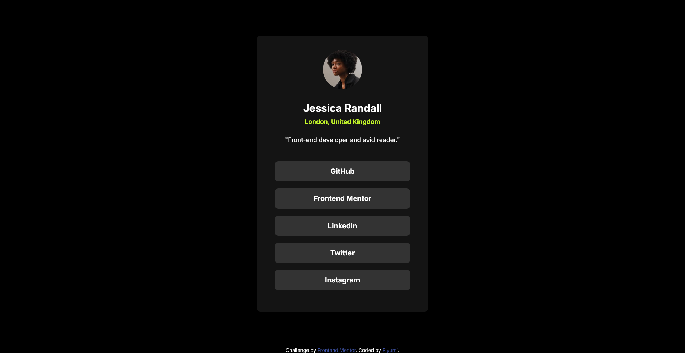

# Frontend Mentor - Social links profile solution

This is a solution to the [Social links profile challenge on Frontend Mentor](https://www.frontendmentor.io/challenges/social-links-profile-UG32l9m6dQ).

## Table of contents

- [Overview](#overview)
  - [The challenge](#the-challenge)
  - [Screenshot](#screenshot)
  - [Links](#links)
- [My process](#my-process)
  - [Built with](#built-with)
  - [What I learned](#what-i-learned)
  - [Continued development](#continued-development)
  - [Useful resources](#useful-resources)
- [Author](#author)
- [Acknowledgments](#acknowledgments)

## Overview

### The challenge

- See hover and focus states for all interactive elements on the page and the responsiveness.

### Screenshot



### Links

- Solution URL: [Add solution URL here](https://your-solution-url.com)
- Live Site URL: [Add live site URL here](https://your-live-site-url.com)

## My process

### Built with

- Semantic HTML5 markup
- CSS custom properties
- Flexbox
- CSS Grid
- Mobile-first workflow (CSS Media Queries)

### What I learned

I learned more about writing media queries to make a responsive solution. Feel free to give your feedback of how I created this media queries. If I made any mistakes, please mention it. I really appreciate. It would be a great help to brushup my css knowledge.

```css
/* 

media queries

*/

@media screen and (max-width: 500px) {

    #links-profile-container {
        width: 90%;
        height: 620px;
    }

    .links-menu li a {
        width: 85%;
        margin-left: auto;
        margin-right: auto;
    }

}

@media screen and (max-width: 280px) {

    .links-menu li {
        width: 260px;
    }

    .links-menu li a {
        font-size: 12px;
        width: 80%;
    }
}
```

### Continued development

I would like to focus more on media queries, css flexbox.

### Useful resources

- [Practical Web Dev] YouTube Channel (https://www.youtube.com/@PracticalWebDev) - This helped me to get started on this challenge. He explained very well. All the credit goes to "Practical Web Dev".

## Author

- Website - [Piyumi]
- Frontend Mentor - [@piyumi-1991](https://www.frontendmentor.io/profile/piyumi-1991)
- Twitter - [@piyumijayamani](https://x.com/piyumijayamani)
